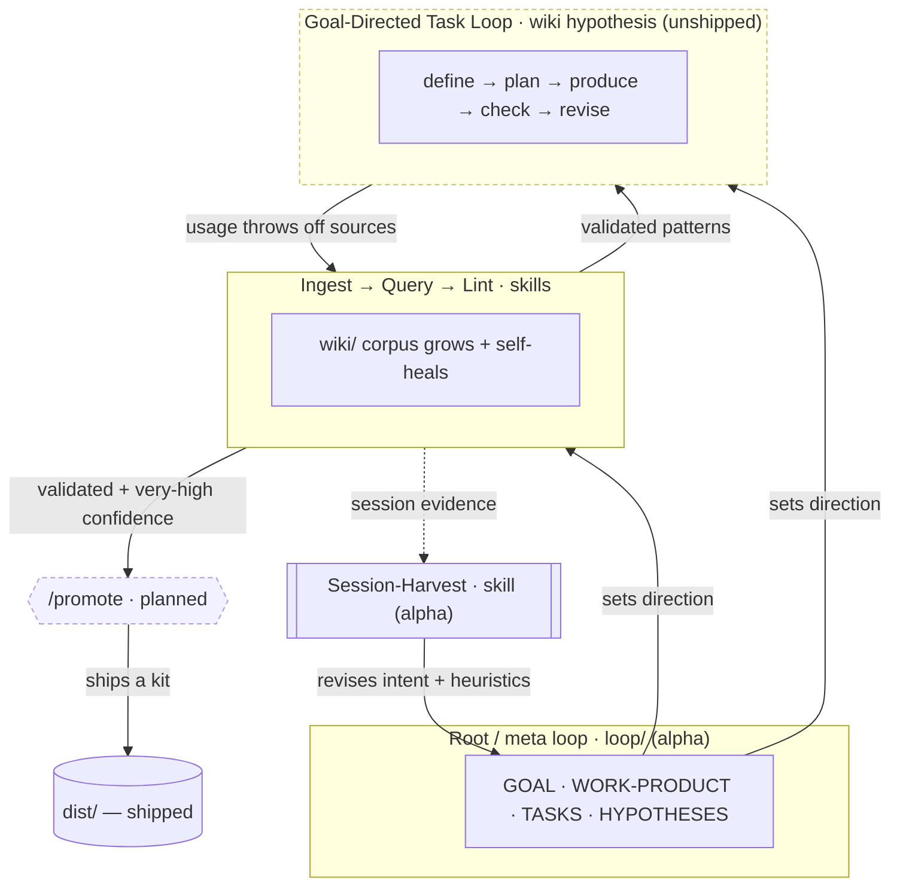

# LOOPS.md — this project's loop portfolio (registry)

The loops **active in this project** and how they relate — an *instance* view, per hypotheses
[H5](HYPOTHESES.md)/[H6](HYPOTHESES.md). This is **not** the same as the
[wiki](../wiki/index.md): the wiki is the **catalog of loop _types_** (eventually dozens–hundreds,
most never run here); this registry lists only what **this repo** runs, with each entry's lifecycle
**status**, where it is **encoded**, and the **edges** between loops. Where a loop also has a
catalog page, the entry links to it (that page holds the mechanism + failure modes). Alpha — the
root loop's live view of itself.

> **Generated — do not hand-edit the regions below.** The single, **self-contained** source of
> truth is [`loops.registry.json`](loops.registry.json). The generator does **not** read the wiki —
> this registry must travel with any repo that *uses* loops, and a user's repo has no research
> wiki. Edit the registry, then run `scripts/gen-loops.sh` (verify with `--check`; also wired into
> `scripts/lint.sh`). `catalog` links are optional cross-references, never a data dependency. This
> realizes task [T3](TASKS.md): the chart is a *view*, never hand-drawn.

## Inventory

<!-- gen-loops:inventory:start -->
| Loop | Status | Encoded in | Goal | Work product | Cadence | Maturity |
| --- | --- | --- | --- | --- | --- | --- |
| Root / meta loop | **active** | loop/ (GOAL·HYPOTHESES·TASKS) | a better repo (research + shipped kits) | the repo itself (self-referential) | steady-state | alpha |
| [Ingest → Query → Lint](../wiki/loops/automation/ingest-query-lint.md) | **active** | skills (.claude/skills/) + CLAUDE.md §3 | keep the wiki/ corpus current | the wiki/ OKF bundle | event-driven | stable |
| [Goal-Directed Task Loop](../wiki/loops/agentic/goal-directed-task-loop.md) | proposed | a wiki/ hypothesis page (no skill yet) | deliver a defined artifact | the artifact | per-step | experimental |
| [Session-Harvest](../wiki/loops/automation/session-harvest.md) | **active** | skill (.claude/skills/session-harvest/) | keep project intent current | GOAL/HYPOTHESES/TASKS/CLAUDE + a heuristics doc | per-session | experimental |
| /promote loop | planned | planned — a future skill (CLAUDE.md §8) | move a validated pattern → dist/ | a shipped kit | on demand | not built |
<!-- gen-loops:inventory:end -->

**Status** = is it running *here* (active) vs proposed / planned — a project-instance fact,
independent of a loop's research **maturity** (an idea-quality fact). The `Loop` column links to a
catalog page where one exists — a cross-reference into *our* wiki; a vendored kit in a non-loops
repo would simply omit it. Every field shown here comes from the registry itself, not the wiki.

## Topology — how the loops feed each other

<!-- gen-loops:topology:start -->

<!-- gen-loops:topology:end -->

Dashed nodes are **not yet active** (proposed / planned). Two readings the registry supports: the
**inventory** (what's active, where encoded, its primitives) and the **topology** (how loops
trigger / improve / feed one another). Session-harvest is the clearest case of a loop *over* another
loop — it maintains the root loop's own primitives.
