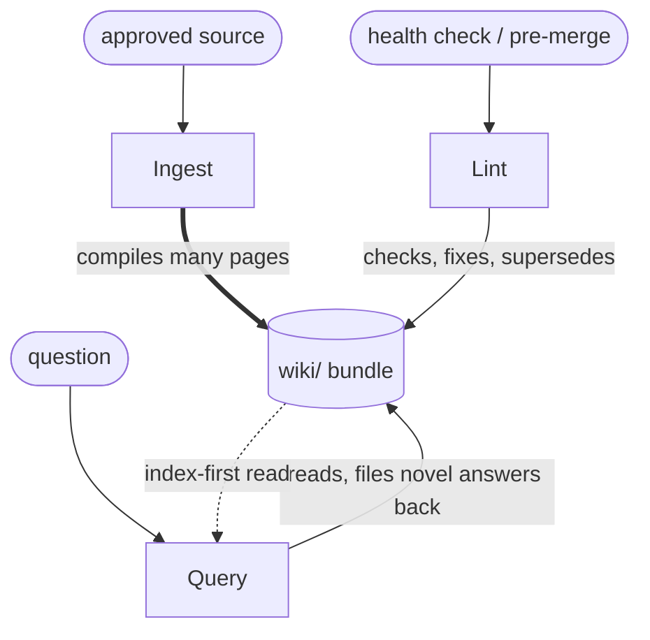

This is the loop this very repository runs on (see the operating manual `CLAUDE.md` §3, at the
repo root). It is both
**agentic** (an LLM does the reasoning) and an **automation** loop (it runs the recurring
work humans abandon). Karpathy's framing: *knowledge is compiled once and then kept current,
not re-derived on every query.*

# Mechanism

One full turn of the loop has three operations; any one can fire independently.

| Op | Trigger | Steps | Touches |
| --- | --- | --- | --- |
| **Ingest** | a source is approved | read → discuss → mirror → write Source concept → compile loop/concept/comparison pages → update indexes → append log | "a single source might touch 10–15 wiki pages" |
| **Query** | a question | read index → drill into pages → synthesize with citations → file novel answers back as pages | the index + a few pages; sometimes adds one |
| **Lint** | periodic / pre-merge | run conformance + lint scripts → review contradictions, drift, orphans, gaps → fix safe items → log | many pages in one pass |

The defining move is **filing answers back**: a good query result (a comparison, a discovered
connection) becomes a new page, so explorations compound just like ingested sources do.

## A second, independent instance

Ouimet's [Karpathy+ system](/sources/ouimet-2026-eqctrl-karpathy-plus.md) is a separately-built
instance of this exact loop, and it sharpens three of the operations with concrete mechanics this
repo can borrow:

- **Ingest → a `Judgment:` line.** Every log entry carries a one-sentence *why*, "what future
  sessions actually use, not the what." (This repo's `log.md` records the *what*; the *why* is the
  enrichment.)
- **Lint → a 13-step checklist.** A weekly run processes an update queue, checks freshness against
  git, broken links, task aging, log gaps, unprocessed sources, log rotation, root cleanliness, an
  **auto-memory-vs-wiki diff**, plan reconciliation, a heartbeat, a report, and optional sync —
  with the restraint *flag once; build infrastructure only when a pattern fires twice*.
- **A completion gate.** "Nothing is done until the change works **and** the docs reflect it" — the
  loop is not closed at the edit; it closes at verification. This is the loop's tie-in to
  [defense in depth](/concepts/defense-in-depth.md): lint is one net, not the whole defense.

Any one operation fires independently; all three maintain the same artifact — the `wiki/` bundle.

# When to use
- A body of knowledge accumulates over time and you want it organized, cross-referenced, and
  current rather than scattered (research, competitive analysis, an evolving thesis).
- Moderate scale: ~100 sources / hundreds of pages, where an `index.md` replaces embedding RAG.
- A human is willing to curate sources and ask good questions while the agent does the rest.

# When not to
- One-shot lookups where nothing accumulates — plain RAG or a single read is cheaper.
- Very large corpora (the pattern is cited as collapsing past ~1,000 files) without adding a
  real search tool and/or splitting into sub-bundles.
- Fully unsupervised operation — without human curation and lint, the wiki drifts toward
  compounding hallucination (see [provenance](/concepts/provenance.md)).

# Failure modes

| Failure | Cause | Mitigation |
| --- | --- | --- |
| Compounding hallucination | LLM-only maintenance, no grounding | per-claim `provenance:`, mandatory `# Citations`, human-in-the-loop ingest |
| [Drift](/concepts/drift.md) (silent) | a page diverges from its source; lint checks pages against each other, not against sources; the model quotes its own frozen summary | `provenance:` + `# Citations` give a line back to the source; keep verbatim `# Notable excerpts`; a human (or future re-grounding pass) must actually re-check — "two copies of anything will drift" |
| Stale claims | newer source contradicts an old page | Lint flags page-vs-newer-source; supersede, don't silently overwrite |
| Orphan / missing pages | cross-refs not maintained | `index.md` discipline + `scripts/lint.sh` orphan check |
| Scale collapse | index outgrows one context window | split into sub-bundles; add hybrid BM25/vector search (`qmd`) |
| Source corruption | agent edits the source of truth | mechanical rule: `sources/` is read-only; nothing auto-promoted from `inbox/` |

# Relationships
- **relies on** [progressive disclosure](/concepts/progressive-disclosure.md) — the index-first
  read is what keeps each pass inside the context window.
- **is governed by** [provenance](/concepts/provenance.md) — the discipline that keeps the
  compounding artifact trustworthy.
- **is threatened by** [drift](/concepts/drift.md) — the silent divergence of a page from its
  source that lint, checking pages against each other, cannot adjudicate on its own.
- **is the subject of** [the synthesis](/synthesis.md) — what makes this loop robust at scale.

# Citations
[1] [Karpathy — "LLM Wiki"](/sources/karpathy-2026-llm-wiki.md) — the three operations,
    the three-layer architecture, and "compiled once, kept current."
[2] [OKF Specification v0.1](/sources/google-2026-okf-spec.md) — the reserved `index.md` /
    `log.md` files and the bundle the loop maintains.
[3] [Ouimet — "An LLM wiki can't tell you when it's wrong"](/sources/ouimet-2026-wiki-graph-drift.md)
    — the drift failure mode and that lint checks pages against each other, not against sources.
[4] [Ouimet — eqctrl.io "Karpathy+" system](/sources/ouimet-2026-eqctrl-karpathy-plus.md) — a
    second built instance: `Judgment:` log lines, the 13-step weekly lint, and the completion gate.
