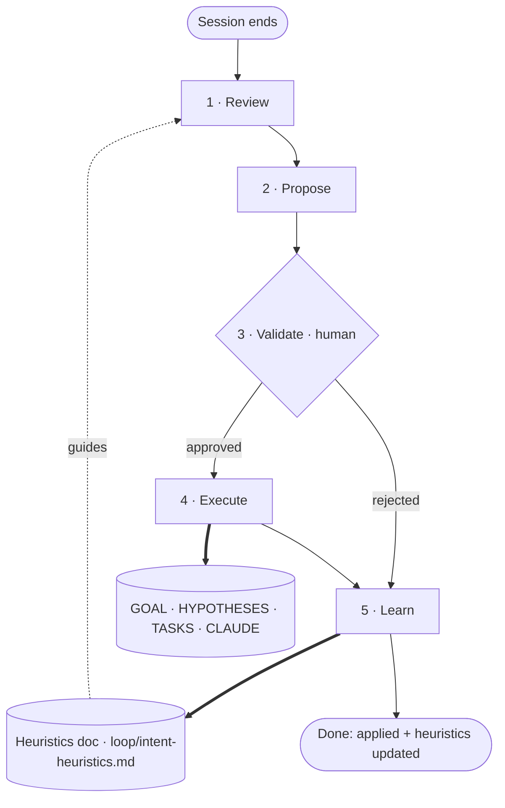

> **⚠ Unvalidated design — alpha skill, not a shipped pattern.** Now wired as an **alpha skill** at
> `.claude/skills/session-harvest/`; its heuristics doc lives in the repo at
> `loop/intent-heuristics.md` (not inside the skill, so it is versioned and human-editable).
> Building the skill makes the loop *runnable*, not *proven* — it remains an unvalidated hypothesis
> ([`H7`](../../../loop/HYPOTHESES.md), task [`T4`](../../../loop/TASKS.md)) and may ship to `dist/`
> only after clearing the promotion bar (`CLAUDE.md` §8). `provenance: inferred`,
> `confidence: 0.35`.

## The question this addresses
A project's **intent** — its goal, constraints, conventions, what's in/out of scope — drifts as
work happens, but the documents that record it (`GOAL.md`, `CLAUDE.md`, a heuristics doc) are
updated by hand, late, or never. The open question: **can an agent reliably harvest intent-changes
from session evidence without (a) hallucinating drift that isn't there or (b) silently rewriting
the project's constitution?** The design below bets the answer is *yes, if every change is
human-validated and the detector is itself a learning artifact.*

This is the [ingest → query → lint loop](/loops/automation/ingest-query-lint.md)'s retro discipline
turned **inward**: instead of keeping the *corpus* current against new sources, it keeps the
*project's stated intent* current against new sessions.

## Hypothesized mechanism (to be tested)
One turn fires at the end of a session (or on demand over a prior one):

| Phase | What happens | Guard |
| --- | --- | --- |
| **Review** | scan the session for evidence that intent changed — new constraints, abandoned directions, conventions that stabilized, scope shifts | guided by the **heuristics doc** (what counts as a real intent-change vs. noise) |
| **Propose** | draft a small, specific list of candidate changes, each pointing at the target doc (`GOAL.md`, `HYPOTHESES.md`, `TASKS.md`, `CLAUDE.md`, taxonomy…) and the session evidence for it | nothing applied yet; every item carries its evidence |
| **Validate** | present the candidates to the human; they accept / reject / edit each | human-in-the-loop is mandatory — this loop touches the project's constitution |
| **Execute** | apply only the **approved** changes to their target docs | respects ownership rules (e.g. `CLAUDE.md`/`_meta/` co-evolved; `dist/` never touched casually) |
| **Learn** | update the **heuristics doc** from the accept/reject feedback — encode what the human waved through and what they rejected, so next pass proposes better | this is the self-improvement; the detector compounds |

The bet: the **Validate** gate prevents constitution-corruption, and the **Learn** step turns a
static checklist into an artifact that converges on *this human's* notion of meaningful intent —
making it an instance of the recursive improvement this library studies (Purpose 2).

The `Learn ⇒ Heuristics doc ⋯⇒ Review` cycle is the self-improvement: rejections and edits tune the
detector so the next harvest proposes better. The amber path through **Validate** is the only way a
change reaches an intent doc.

## The heuristics doc (the load-bearing artifact)
Not prose — a structured, append-friendly record the loop both *reads* (in Review) and *writes*
(in Learn). Candidate shape:

- **Signals** — patterns that count as intent-change (e.g. "human reverses a prior decision",
  "a convention is repeated 3+ times", "scope is explicitly narrowed/widened").
- **Anti-signals** — things that look like drift but aren't (one-off exploration, a tool failure,
  thinking-out-loud the human walked back).
- **Targets** — which doc each kind of change lands in, and its ownership rule.
- **Decisions log** — past accept/reject calls with the evidence, so the detector calibrates.

Each Learn step appends or edits here; over time it becomes the project's tuned drift-detector.

## What we'd need to validate before shipping
- Evidence the loop catches real intent-changes a human agrees with, with a low false-positive
  rate — measured over real sessions, not asserted.
- A defensible answer to the constitution-corruption risk (the Validate gate must be genuinely
  hard to bypass; "execute" must never run on un-approved items).
- Evidence the heuristics doc actually improves precision over time (the Learn step earns its
  keep) rather than accreting noise.
- Very-high confidence + a deliberate go/no-go (`CLAUDE.md` §8) before any `dist/` ship.

## Implementation (alpha)
- **Skill:** `.claude/skills/session-harvest/` — runs the five phases above.
- **Heuristics doc:** `loop/intent-heuristics.md` — repo-level (not inside the skill) so it is
  versioned and human-editable; Review reads it, Learn updates it.
- **Ownership the skill obeys:** edits `loop/GOAL|HYPOTHESES|TASKS` and the loop registry freely
  (alpha); **proposes only** changes to `CLAUDE.md` / `_meta/` (co-evolve, §4); **never** touches
  `dist/` or `sources/`. Nothing is applied without the human's Validate.

## Relationships
- **specializes** the [ingest → query → lint loop](/loops/automation/ingest-query-lint.md): same
  detect → validate → apply → improve retro shape, but the maintained artifact is *project intent*,
  not the source corpus.
- **writes to the root loop's primitives** — `GOAL.md`, `HYPOTHESES.md`, `TASKS.md` — so it is a
  meta-loop *over* the root/meta loop; a clean example of loops feeding loops (hypothesis
  [`H5`](../../../loop/HYPOTHESES.md)).
- **depends on** [provenance](/concepts/provenance.md) for the evidence discipline: every proposed
  change must cite the session evidence behind it, just as compiled pages cite sources.
- **contrasts with** the [goal-directed task loop](/loops/agentic/goal-directed-task-loop.md): that
  one *pursues* a fixed goal; this one *maintains the goal itself.*

## Citations
[1] [Karpathy — "LLM Wiki"](/sources/karpathy-2026-llm-wiki.md) — the agent-maintains-the-artifact
    operating model and the retro/lint discipline this loop turns inward onto project intent.
